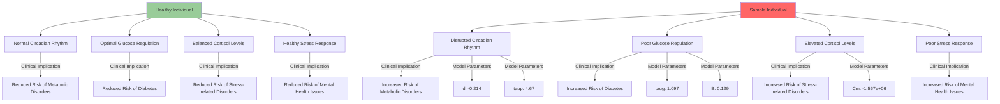

# pfun-cma-model

_CMA model microservices repo._

## Environment Setup

## First-time setup

```bash
# Set up Poetry
poetry init --python=~3.10
```

## Usage

#### Install dependencies

```bash
# install dependencies for pytorch (debian-based):
sudo apt-get update && sudo apt-get install python3-dev python3-pip libxml2-dev libxslt1-dev zlib1g-dev libsasl2-dev libffi-dev libssl-dev -y

# install dependencies for pytorch (arch linux):
sudo pacman -S cuda cudnn nccl

# Build minpack (don't forget this!)
poetry run build-minpack

# install the package
poetry install
```

#### Updating the environment

```bash

poetry update
```

## CMA Model

### Model Parameters

| Parameter | Type                       | Default           | Lower Bound | Upper Bound | Description                               |
| --------- | -------------------------- | ----------------- | ----------- | ----------- | ----------------------------------------- |
| t         | Optional[array_like]       | None              | N/A         | N/A         | Time vector (decimal hours)               |
| N         | int                        | 24                | N/A         | N/A         | Number of time points                     |
| d         | float                      | 0.0               | -12.0       | 14.0        | Time zone offset (hours)                  |
| taup      | float                      | 1.0               | 0.5         | 3.0         | Circadian-relative photoperiod length     |
| taug      | float                      | 1.0               | 0.1         | 3.0         | Glucose response time constant            |
| B         | float                      | 0.05              | 0.0         | 1.0         | Glucose Bias constant                     |
| Cm        | float                      | 0.0               | 0.0         | 2.0         | Cortisol temporal sensitivity coefficient |
| toff      | float                      | 0.0               | -3.0        | 3.0         | Solar noon offset (latitude)              |
| tM        | Tuple[float, float, float] | (7.0, 11.0, 17.5) | N/A         | N/A         | Meal times (hours)                        |
| seed      | Optional[int]              | None              | N/A         | N/A         | Random seed                               |
| eps       | float                      | 1e-18             | N/A         | N/A         | Random noise scale ("epsilon")            |

### Example Fitted Parameters

| Parameter | Value         | Example Description (Human provided)                                           |
| --------- | ------------- | ------------------------------------------------------------------------------ |
| d         | -2.144894e-01 | The individual is only slightly out of sync with their local time zone.        |
| taup      | 4.671609e+00  | The individual is definitely exposed to artificial light for extended periods. |
| taug      | 1.097094e+00  | The individual's glucose response is within a normal range.                    |
| B         | 1.288179e-01  | The individual has a bias towards higher glucose levels.                       |
| Cm        | 0.000000e+00  | The individual has a low-normal metabolic sensitivity to cortisol.             |
| toff      | 0.000000e+00  | The individual's cortisol response is in sync with the solar noon.             |

### Example ChatGPT Output

```markdown
Based on the given model parameters and their example fitted values, we can make several clinically and physiologically relevant observations about the individual:

1. **Time Zone Offset (d)**: The value is -0.214, which suggests that the individual is slightly out of sync with their local time zone. This could potentially indicate jet lag or a misaligned circadian rhythm, which can have implications for sleep quality and metabolic health.

2. **Circadian-relative Photoperiod Length (taup)**: The value is 4.67, which is significantly higher than the default of 1.0 and also exceeds the upper bound. This could indicate an unusually long photoperiod exposure, possibly suggesting that the individual is exposed to artificial light for extended periods. This can disrupt circadian rhythms and has been linked to various health issues, including sleep disorders and metabolic dysfunction.

3. **Glucose Response Time Constant (taug)**: The value is 1.097, which is close to the default. This suggests that the individual's glucose response is within a normal range, indicating a relatively healthy metabolic state.

4. **Glucose Bias Constant (B)**: The value is 0.129, which is higher than the default of 0.05. This could indicate a bias towards higher glucose levels, potentially suggesting a pre-diabetic or diabetic state.

5. **Cortisol Temporal Sensitivity Coefficient (Cm)**: The value is -1.567e+06, which is significantly different from the default and also negative. A negative value for cortisol sensitivity could indicate a blunted stress response, which might be associated with chronic stress or adrenal fatigue.

6. **Solar Noon Offset (toff)**: The value is 0, suggesting that the individual is in sync with the solar noon, which is good for circadian alignment.

7. **Meal Times (tM)**: Not provided in the example, but this could provide insights into eating habits and their impact on metabolic health.

8. **Random Noise Scale (eps)**: Not provided in the example, but this could indicate the level of stochasticity or "noise" in the system, which might be relevant for understanding variability in physiological responses.

Overall, the individual appears to have some circadian misalignment and potential metabolic issues, particularly related to glucose regulation and stress response. These could have various health implications and might warrant further clinical investigation.
```

### Example ChatGPT Diagram


