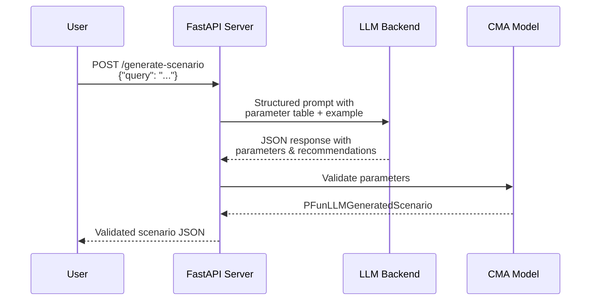

# LLM Scenario Generation

## Overview

The LLM scenario generation system translates **natural language descriptions** into **physiologically valid CMA model parameters**. It uses structured prompting with few-shot examples to ensure the generated parameters are biophysically sound.



## Live Demo


The demo at `/demo/llm` provides a text input where you describe a person's health profile, and the system generates:

1. **Forecasted events** — Predicted health outcomes
2. **Qualitative description** — Clinical summary of metabolic health
3. **Parameters** — CMA model parameters with values, descriptions, and standard errors
4. **Recommendations** — Actionable health tips mapped to specific parameter deviations


## Supported LLM Backends

| Backend | Config Value | Description |
|---------|-------------|-------------|
| Ollama | `ollama` | Local inference (default) |
| Google Gemini | `google` | Cloud-based via `google-genai` |
| Perplexity | `perplexity` | Online-search-augmented |
| OpenAI | `openai` | GPT models |

Set via environment variable:

```bash
LLM_BACKEND=ollama  # in .env
```

## CLI Usage

```bash
# Generate a scenario
uv run pfun-cma-model generate-scenario \
  --query "a patient with chronic stress that exacerbates the risk of glucose lows in the evening"

# Default healthy individual
uv run pfun-cma-model generate-scenario
```

## Python API

```python
import asyncio
from pfun_cma_model.llm import generate_scenario

# Generate a scenario
scenario = asyncio.run(
    generate_scenario(
        query="an athlete who trains at 5am daily",
        include_recommendations=True,
    )
)

print(scenario.qualitative_description)
print(scenario.parameters)
print(scenario.recommendations)
```

## Response Schema

The `PFunLLMGeneratedScenario` Pydantic model:

```python
class PFunLLMGeneratedScenario(BaseModel):
    forecasted_events: str
    # Predicted health events

    qualitative_description: str
    # Clinical description of metabolic health

    parameters: dict[str, DescribedParameter]
    # {param_name: {value, description, stderr}}

    recommendations: dict[str, str]
    # {recommendation_type: specific_advice}
```

Each parameter includes:

```python
class DescribedParameter(BaseModel):
    value: float | int       # Parameter value
    description: str         # Text description
    stderr: float            # Standard error estimate
```

## How the Prompt Works

The LLM prompt includes:

1. **Baseline parameter table** — Generated from `CMAModelParams().generate_markdown_table()`
2. **Few-shot example** — A stressed individual with `Cm=1.5, B=0.001, taug=0.4`
3. **Qualitative descriptors** — Automatically generated labels ("Very High", "Low", etc.)
4. **Recommendation template** — Maps parameter deviations to actionable advice

This ensures the LLM understands the parameter space and generates physiologically plausible values.
