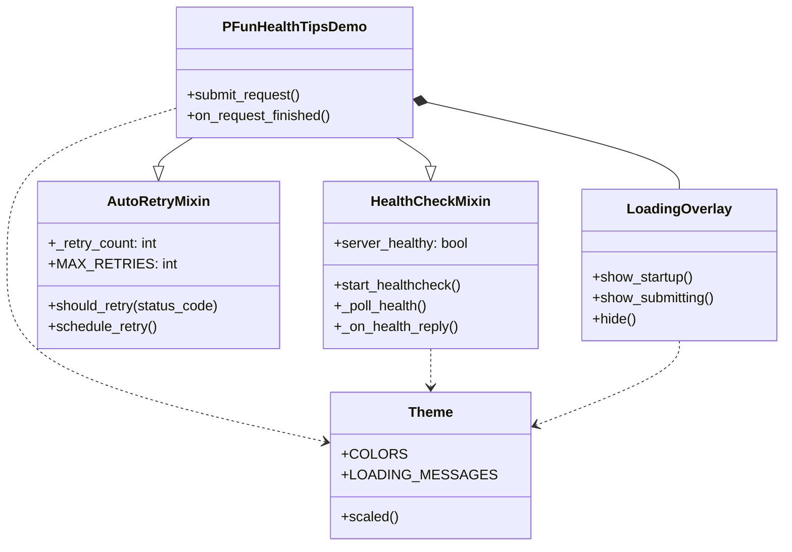

# Qt Desktop GUI

## Overview

The **PFun Health Tips** Qt GUI (`pfun_qt_gui`) is a native desktop application built with PyQt6/PySide6 that provides a user-friendly interface for LLM-powered health scenario generation.

## Features

- **Server health checks** — Automatic polling with visual feedback during startup
- **Auto-retry on failures** — Transparent retry logic for 500 errors (up to 3 attempts)
- **Loading overlay** — Animated blocking UI during server connection and request processing
- **DPI-aware design** — Responsive scaling across desktop, mobile, and TV displays
- **Centralized theming** — All styling managed through a `theme` module

## Architecture



## Installation & Launch

```bash
# Install Qt6 dependencies
uv sync --group qt6

# Launch (starts API server + GUI)
./scripts/launch-qt-gui.sh
```

The launch script:

1. Starts the FastAPI dev server in the background
2. Waits for the server to become available
3. Syncs the Qt GUI package dependencies
4. Launches the Qt application

## Configuration

The Qt GUI reads its configuration from `packages/pfun_qt_gui/.env`:

```ini
# API endpoint (Tailscale or localhost)
SERVER_URL=https://gbot.tail38611b.ts.net:8001

# Health check endpoint
HEALTH_ENDPOINT=/health

# Scenario generation endpoint
GENERATE_ENDPOINT=/generate-scenario
```

## Mixin Architecture

### HealthCheckMixin

Encapsulates the server health polling mechanism:

```python
class HealthCheckMixin:
    """Polls /health endpoint until the server is ready."""

    HEALTHCHECK_INTERVAL_MS = 2000  # Poll every 2 seconds
    HEALTHCHECK_MAX_ATTEMPTS = 30   # Give up after 30 attempts

    def start_healthcheck(self):
        """Begin polling the health endpoint."""

    def _on_health_reply(self):
        """Handle successful health response → enable UI."""
```

### AutoRetryMixin

Automatically retries failed requests (HTTP 500):

```python
class AutoRetryMixin:
    """Retries failed requests with exponential backoff."""

    MAX_RETRIES = 3
    RETRY_DELAY_MS = 1000

    def should_retry(self, status_code: int) -> bool:
        """Returns True for HTTP 500 errors under retry limit."""

    def schedule_retry(self):
        """Queue a retry with the original request payload."""
```

## Testing

```bash
# Run Qt GUI tests
cd packages/pfun_qt_gui
uv run pytest tests/ -v

# Specific test files
uv run pytest tests/test_healthcheck_mixin.py -v
uv run pytest tests/test_auto_retry_mixin.py -v
uv run pytest tests/test_theme.py -v
```
