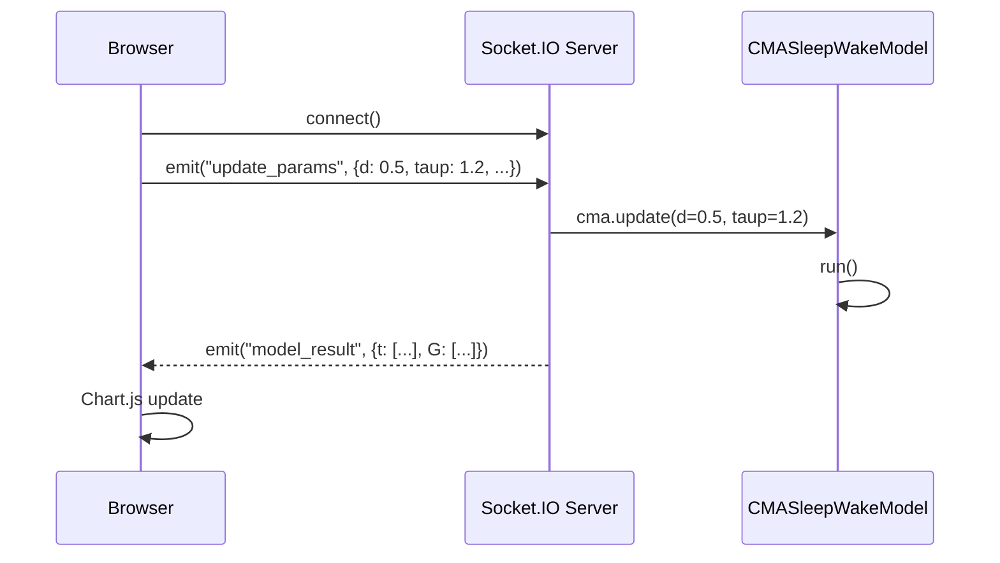

# WebSocket Streaming

## Overview

The WebSocket streaming demos provide **real-time, bidirectional communication** between the browser and the CMA model. Adjust parameter sliders and see glucose curves update instantly.

## Run-at-Time Demo

The primary WebSocket demo at `/demo/run-at-time` lets you:

- Adjust all six bounded CMA parameters via sliders
- Set meal times interactively
- Watch the glucose curve update in real-time via [Chart.js](https://www.chartjs.org/)


## Video Demo

<video controls width="100%">
  <source src="../assets/video/Screencast From 2026-01-12 21-58-05 (trimmed).mp4" type="video/mp4">
  <source src="../assets/video/Screencast From 2026-01-12 21-58-05 (trimmed).webm" type="video/webm">
  Your browser does not support the video tag.
</video>

## Architecture



The server uses [python-socketio](https://python-socketio.readthedocs.io/) for WebSocket communication, with Redis as the message broker for horizontal scaling.

## Available WebSocket Demos

| Demo | Endpoint | Rendering | Description |
|------|----------|-----------|-------------|
| **Run-at-Time** | `/demo/run-at-time` | Chart.js | Parameter sliders + glucose chart |
| **Canvas Wave** | `/demo/canvas-wave` | HTML5 Canvas | 1D wave equation visualization |
| **Full Model Run** | `/demo/full-model-run` | Chart.js | All signals (c, m, a, G) |
| **WebGL Plot** | `/demo/webgl-demo` | WebGL-Plot | GPU-accelerated real-time rendering |

## Running Locally

```bash
# Start the dev server (includes WebSocket support)
uv run fastapi dev pfun_cma_model/app.py --port 8001

# Then open in browser:
# http://localhost:8001/demo/run-at-time
```

## Client-Side Integration

Each demo page loads Socket.IO and connects to the server:

```javascript
const socket = io("ws://localhost:8001", {
    transports: ["websocket"],
});

// Send parameter update
socket.emit("update_params", {
    d: parseFloat(dSlider.value),
    taup: parseFloat(taupSlider.value),
    taug: parseFloat(taugSlider.value),
    B: parseFloat(bSlider.value),
    Cm: parseFloat(cmSlider.value),
    toff: parseFloat(toffSlider.value),
});

// Receive model results
socket.on("model_result", (data) => {
    updateChart(data.t, data.G);
});
```
