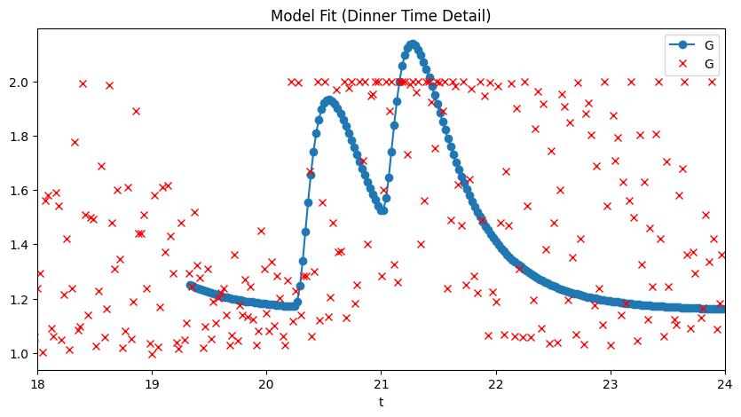

# Quickstart

This guide walks you through the most common workflows in under 5 minutes.

## 1. Run the CMA model

The simplest way to generate a CMA decomposition:

```python
from pfun_cma_model import CMASleepWakeModel

# Create a model with default parameters
cma = CMASleepWakeModel(N=288)  # 288 points = 5-min resolution

# Run the model and get results as a DataFrame
df = cma.run()
print(df.head())
```

Output columns include: `t` (time), `c` (cortisol), `m` (melatonin), `a` (adiponectin), `I_S` (insulin sensitivity), `I_E` (insulin effect), `L` (light), and per-meal glucose components `g_0`, `g_1`, `g_2`, plus total glucose `G`.

## 2. Fit the model to data

Fit the CMA model to CGM (continuous glucose monitor) data:

```python
import pandas as pd
from pfun_cma_model import fit_model

# Load your CGM data (must have columns: 't' and 'G')
data = pd.read_csv("your_cgm_data.csv")

# Fit the model
result = fit_model(data, N=1024, plot=False)

# Inspect the optimized parameters
print(result.popt_named)
# {'d': -0.21, 'taup': 4.67, 'taug': 1.10, 'B': 0.13, 'Cm': 0.00, 'toff': 0.00}
```


## 3. Fit model via CLI

```bash
# Download sample data, fit, and plot
uv run pfun-cma-model download-sample-data
uv run pfun-cma-model fit-model --plot
```



The fitted parameters and solution are saved to `results/fit_result.json`.

## 4. Generate an LLM scenario

Use natural language to generate physiologically valid parameter sets:

```bash
uv run pfun-cma-model generate-scenario \
  --query "a healthy individual with a tendency to sleep in"
```

```json
{
    "qualitative_description": "This individual is a healthy young adult
      who is a natural 'night owl'...",
    "parameters": {
        "toff": 2.5,
        "d": 0,
        "taup": 1,
        "taug": 1,
        "B": 0.05,
        "Cm": 0
    }
}
```

## 5. Run the parameter grid search

Explore the parameter space systematically:

```bash
# Run a 6×3 parameter grid
uv run pfun-cma-model run-param-grid -N 6 -m 3

# Results saved as Parquet and into DuckDB
```


## 6. Start the web application

```bash
# Development server with auto-reload
uv run fastapi dev pfun_cma_model/app.py --port 8001

# — or via the CLI —
uv run pfun-cma-model launch --port 8001 --reload
```

Then open:

- **Swagger UI**: [http://localhost:8001/docs](http://localhost:8001/docs)
- **ReDoc**: [http://localhost:8001/redoc](http://localhost:8001/redoc)
- **LLM Demo**: [http://localhost:8001/demo/llm](http://localhost:8001/demo/llm)
- **WebSocket Demo**: [http://localhost:8001/demo/run-at-time](http://localhost:8001/demo/run-at-time)

## 7. Launch the Qt desktop GUI

```bash
# Requires the qt6 dependency group
uv sync --group qt6

# Launch
./scripts/launch-qt-gui.sh
```

The Qt GUI provides a native desktop interface with:

- Server health checks with auto-reconnect
- LLM scenario generation with auto-retry on failures
- Responsive, DPI-aware design

---

**→ Next: [CMA Model Overview](../model/overview.md)**
