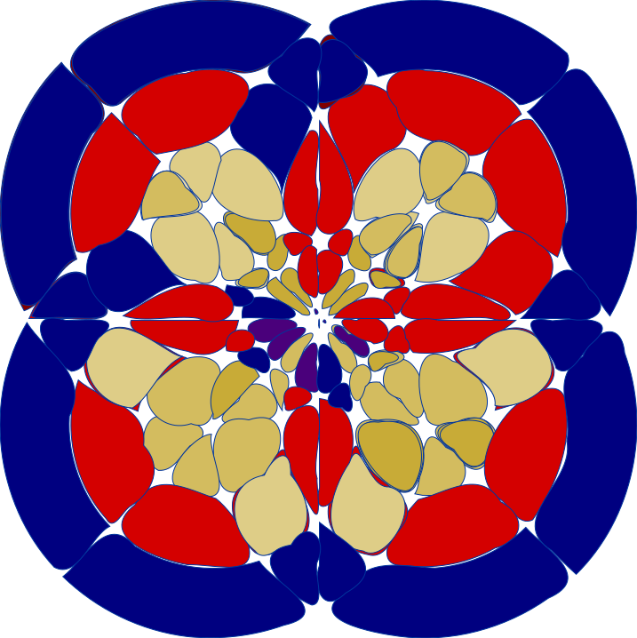
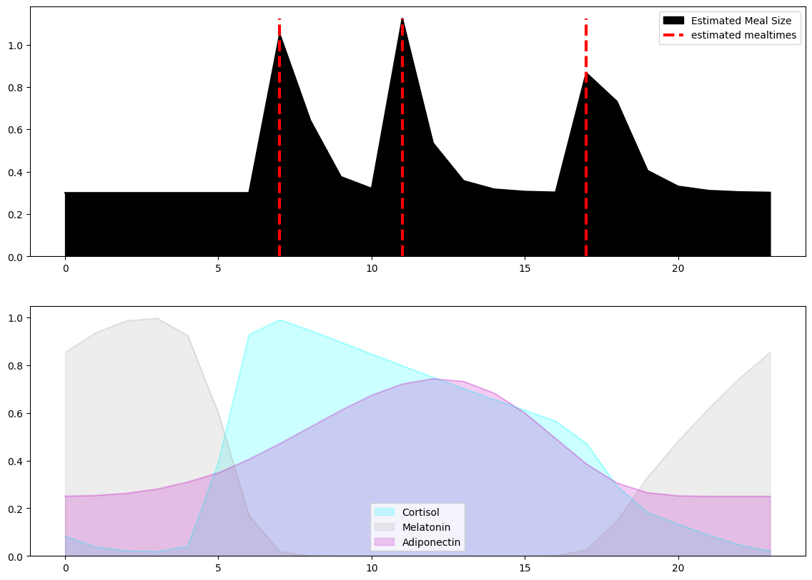
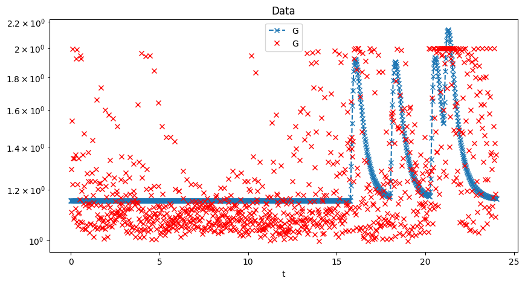
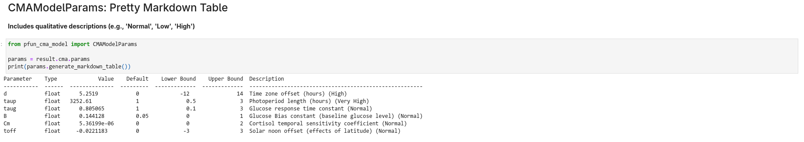
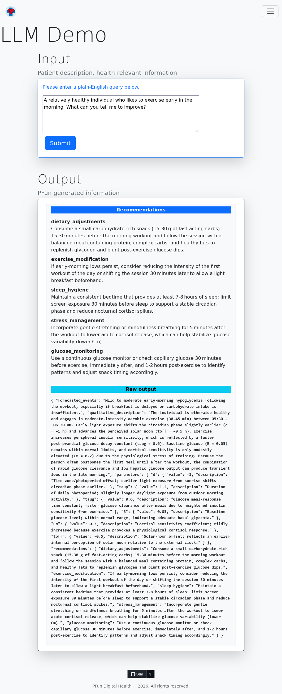
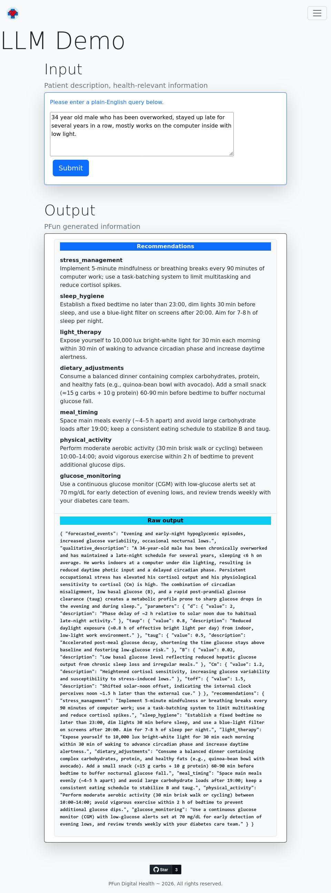
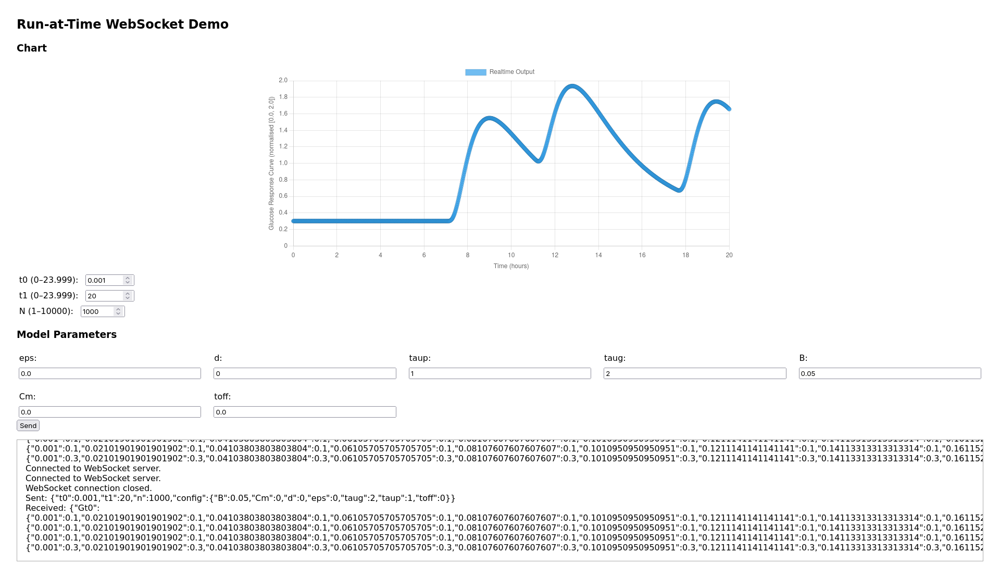
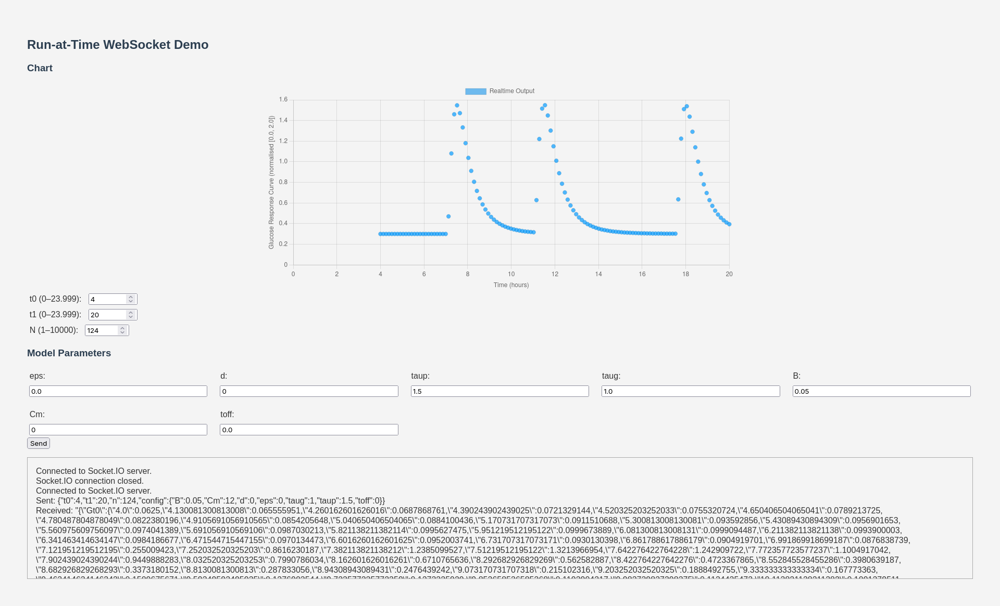
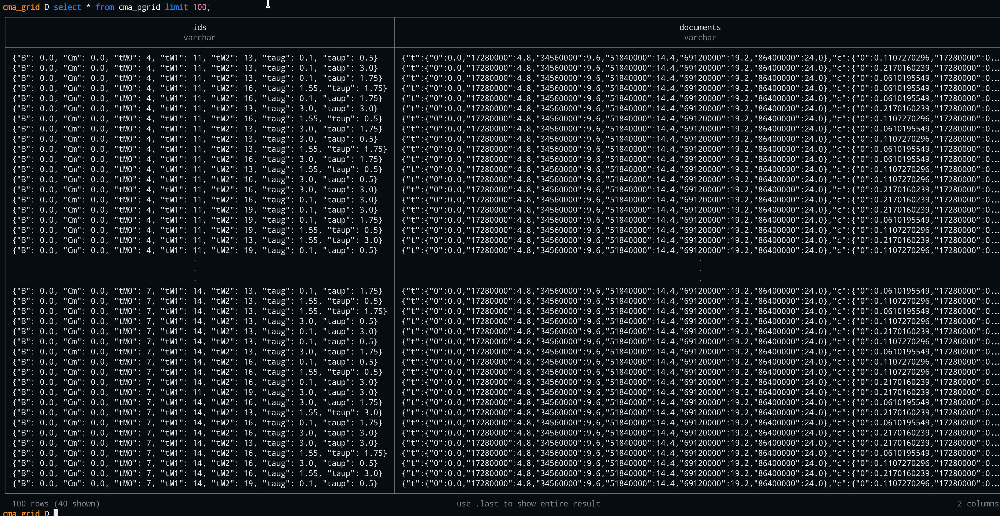

# PFun CMA Model

_A physiofunctional chronometabolic model implementation (numerical inference for glucose, stress hormones, circadian time series)._

<div align="center">


<hr style="max-width: 25%;" />

<a href="https://www.python.org/downloads/"></a>
<a href="https://fastapi.tiangolo.com"></a>
<hr style="max-width: 25%;" />
<a title="API Docs" href="https://pfun-health.github.io/pfun-cma-model/api" style="border-radius: 10%; padding: 4pt; color: white; background: blue;">API Docs</a>
<a title="Source Code" href="https://github.com/pfun-health/pfun-cma-model" style="border-radius: 10%; padding: 4pt; color: white; background: blue;">Source Code</a>

</div>

---

## What is PFun CMA?

The **PFun CMA Model** is a generative physiological model that functionally replicates neuroendocrine dynamics — specifically the interplay between **cortisol**, **melatonin**, and **adiponectin** — and their influence on glucose metabolism across the circadian cycle.

### In simple terms

- 🗜  **Phase-based dimensionality reduction** — Compress weeks or months of CGM time-series data into a compact phase vector (`≥ 1024b in memory`).
- 🕮  **Interpretable & Quantifiable** — Translate between qualitative states ("mood", "stress") and biophysical neuroendocrine dynamics ("cortisol levels", "glucose variability").
- 🕒 **High-speed circadian mapping** — Understand how circadian rhythm maps to glucose values in real time.

---

## Generated CMA Decomposition

The model decomposes glucose time series data into underlying hormonal influences:



> The CMA model leverages physiological modeling principles to decompose glucose time series data into underlying hormonal influences — specifically cortisol, melatonin, and adiponectin.

---

## Model Fitting

Fit the CMA model to real CGM data and extract clinically meaningful parameters:



After fitting, visualize parameters with automatically generated qualitative descriptions:



---

## Live Demos

### LLM-Powered Scenario Generation

Generate realistic physiological scenarios using natural language prompts. The LLM translates qualitative descriptions into physiologically valid CMA parameters:





---

### Real-time WebSocket Streaming

Interactive parameter control with live chart updates via WebSocket:





---

### Parameter Grid Visualization

Explore the CMA parameter space with precomputed grids:



---

## Quick Start

```bash
# Install
pip install pfun-cma-model
# — or with uv —
uv add pfun-cma-model

# Run a quick model fit
uv run pfun-cma-model fit-model --plot

# Generate a scenario via LLM
uv run pfun-cma-model generate-scenario \
  --query "a healthy individual who exercises before sunrise"

# Launch the full dev server
uv run fastapi dev pfun_cma_model/app.py --port 8001
```

**→ [Full installation guide](getting-started/installation.md)**

---

## Project Architecture

```
pfun-cma-model/
├── pfun_cma_model/          # Core Python package
│   ├── engine/              # CMA model, fit, grid, plotting
│   ├── routes/              # FastAPI route handlers
│   ├── llm.py               # LLM prompting logic
│   ├── cli.py               # Click CLI commands
│   └── security.py          # Security middleware
├── examples/
│   ├── notebooks/           # Jupyter notebooks
│   ├── screenshots/         # Application screenshots
│   └── videos/              # Demo recordings
├── docs/                    # This documentation (Zensical)
├── tests/                   # Test suite
└── results/                 # Output artifacts & databases
```

---

## Key Links

| Resource | Link |
|----------|------|
| :material-web: Homepage | [pfun.one](https://pfun.one/) |
| :material-play-circle: Live Demo | [PFun Health Tips](https://pfun.one/demo/llm) |
| :material-github: Source Code | [pfun-health/pfun-cma-model](https://github.com/pfun-health/pfun-cma-model) |
| :material-file-document: Research Paper | [Chronometabolic Analysis (PDF)](https://github.com/pfun-health/pfun-cma-model/blob/main/docs/rendered_pdf/PFun%20Glucose%20-%20Chronometabolic%20Analysis.pdf) |
| :material-api: API Swagger | `http://localhost:8001/docs` |
| :material-api: API ReDoc | `http://localhost:8001/redoc` |
