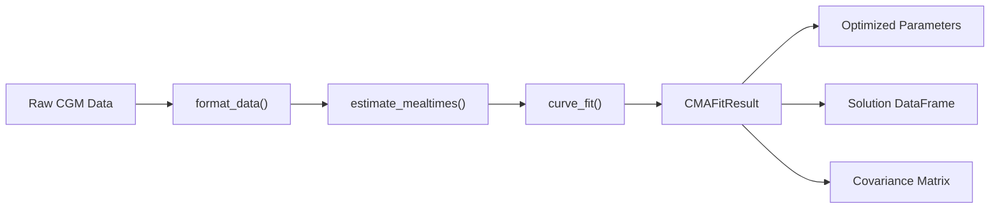
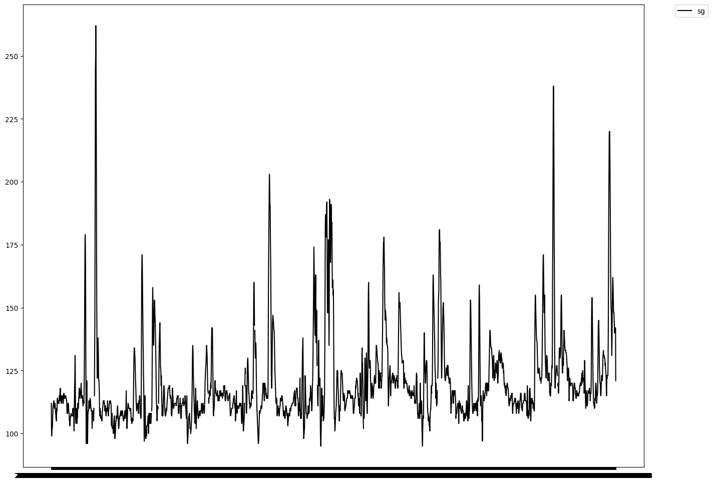

# Model Fitting

## Overview

The `fit_model` function uses `scipy.optimize.minimize` (L-BFGS-B by default) to fit the CMA model to observed glucose data. It returns a `CMAFitResult` containing the optimized parameters, the model solution, and diagnostic information.



## Python API

### Basic fitting

```python
import pandas as pd
from pfun_cma_model import fit_model

# Load CGM data (columns: 't' for time in hours, 'G' for glucose)
data = pd.read_csv("cgm_data.csv")

# Fit with defaults
result = fit_model(data)

# Access results
print(result.popt_named)    # Named optimized parameters
print(result.soln.head())   # Model solution DataFrame
print(result.cond)          # Condition number of covariance matrix
```

### Custom fitting

```python
result = fit_model(
    data,
    N=1024,                   # Number of output time points
    tcol="t",                 # Time column name
    ycol="G",                 # Glucose column name
    tM=[7.0, 12.0, 18.0],    # Fixed meal times (skip estimation)
    tm_freq="2h",             # Frequency for mealtime estimation
    curve_fit_kwds={
        "method": "L-BFGS-B",
        "ftol": 1e-18,
        "xtol": 1e-18,
        "max_nfev": 150000,
    },
)
```

## Mealtime Estimation

If meal times are not provided, they are automatically estimated from the glucose data using peak-detection:

```python
from pfun_cma_model.engine.fit import estimate_mealtimes

# Estimate meal times from glucose peaks
meal_times = estimate_mealtimes(data, ycol="G", tm_freq="2h", n_meals=4)
print(meal_times)
# array([ 7.2, 12.1, 17.8, 21.3])
```

## CMAFitResult

The `CMAFitResult` is a Pydantic model containing:

| Field | Type | Description |
|-------|------|-------------|
| `soln` | `pd.DataFrame` | Full model solution (all signals) |
| `formatted_data` | `pd.DataFrame` | Input data after formatting |
| `cma` | `CMASleepWakeModel` | Fitted model instance |
| `popt` | `np.ndarray` | Optimized parameter vector |
| `pcov` | `np.ndarray` | Estimated covariance matrix |
| `popt_named` | `dict` | Parameters as `{name: value}` |
| `cond` | `float` | Condition number of covariance |
| `diag` | `np.ndarray` | Diagonal of covariance matrix |
| `mesg` | `str` | Optimizer message |
| `ier` | `int` | Convergence status code (0 = success) |

### Serialization

```python
# Save as JSON
with open("results/fit_result.json", "w") as f:
    f.write(result.model_dump_json())

# Load back (via dict)
import json
data = json.loads(result.model_dump_json())
```

## CLI Fitting

```bash
# Fit model with sample data and plot the result
uv run pfun-cma-model fit-model --plot

# Fit with custom input file
uv run pfun-cma-model fit-model \
  -i path/to/cgm_data.csv \
  -o results/ \
  --N 1024 \
  --plot

# Override output format
uv run pfun-cma-model fit-model --plot --ftype svg
```

## Visual Results

### 24-Hour Fit


### Dinner Period Fit


### Sample Data



## Optimization Details

The fitting pipeline uses **L-BFGS-B** (Limited-memory Broyden–Fletcher–Goldfarb–Shanno with Bound constraints) by default:

- **Objective**: Minimize `Σ(y_observed - G_model)²`
- **Bounds**: All bounded parameters are constrained (see [Parameters](parameters.md))
- **Convergence**: `ftol=1e-18`, `xtol=1e-18`, `max_nfev=N×1000`

Alternative methods supported: `Nelder-Mead`, `Powell`, `TNC`, `trust-constr`.

**→ Next: [Demos & Examples](../demos/gallery.md)**
