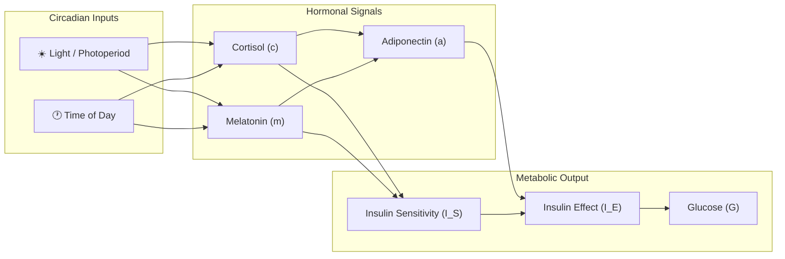

# CMA Model Overview

## The Cortisol-Melatonin-Adiponectin Model

The **CMASleepWakeModel** is a physiological model that decomposes glucose dynamics into three primary hormonal components that govern circadian metabolic regulation:



## Signal Components

### Cortisol (`c`)

Cortisol follows a **dawn-peak** pattern, driven by the hypothalamic-pituitary-adrenal (HPA) axis. In the model, cortisol is sensitive to light exposure and peaks shortly after waking.

$$
c(t) \propto E\left[(L - 0.88)^3\right] \cdot E\left[0.05 \cdot (8 - t + d)\right] \cdot E\left[2 \cdot (-m)^3\right]
$$

### Melatonin (`m`)

Melatonin is the **darkness hormone**, inversely related to light exposure. It governs sleep-wake transitions:

$$
m(t) = (1 - L)^3 \cdot \cos^2\left(\frac{-(t - 3 - d) \cdot \pi}{24}\right)
$$

### Adiponectin (`a`)

Adiponectin modulates insulin sensitivity and interacts with both cortisol and melatonin:

$$
a(t) = \frac{E\left[(-c \cdot m)^3\right] + e^{-0.025(t - 13 - d)^2} \cdot L(0.7(27 - t + d))}{2}
$$

### Glucose (`G`)

Post-prandial glucose is computed as a vectorized function of insulin effect, meal times, and response kinetics:

$$
G(t) = \sum_{i=1}^{n_{\text{meals}}} g_i(t, I_E, t_{M_i}, \tau_g, B, C_m, t_{\text{off}})
$$

## Example: Running the Model

```python
from pfun_cma_model import CMASleepWakeModel

# Default parameters — healthy individual at baseline
cma = CMASleepWakeModel(N=288)

# Run and inspect
df = cma.run()
print(df[['t', 'c', 'm', 'a', 'G']].head(10))
```

| Signal | Description | Key Property |
|--------|-------------|--------------|
| `c` | Cortisol | Dawn-peaking stress hormone |
| `m` | Melatonin | Darkness-activated sleep signal |
| `a` | Adiponectin | Insulin sensitivity modulator |
| `I_S` | Insulin Sensitivity | `1.0 - 0.23c - 0.97m` |
| `I_E` | Insulin Effect | `a × I_S` |
| `G` | Glucose | Summed post-prandial response |

## Decomposition Visualization


The plot above shows a typical CMA decomposition from glucose time series data, revealing the underlying hormonal dynamics across a 24-hour period.

## Key Class: `CMASleepWakeModel`

```python
class CMASleepWakeModel:
    """Cortisol-Melatonin-Adiponectin Sleep-Wake Model.

    Core workflow:
    1) Input SG → Project to 24-hour phase plane.
    2) Estimate photoperiod → Model params (d, τp).
    3) Fit to projected SG → Compute chronometabolic dynamics.
    """

    def __init__(self, config=None, **kwds):
        """Initialize with CMAModelParams or keyword arguments."""

    def run(self) -> pd.DataFrame:
        """Run the model, return solution as labeled DataFrame."""

    def update(self, model_params=None, inplace=True, **kwds):
        """Update parameters in-place or return a new instance."""

    @property
    def G(self) -> np.ndarray:
        """Post-prandial glucose dynamics."""

    @property
    def g_instant(self) -> np.ndarray:
        """Instantaneous (summed) glucose across all meals."""

    def calc_Gt(self, t=None, dt=None, n=1) -> pd.DataFrame:
        """Calculate glucose at arbitrary future time points."""
```

**→ Next: [Model Parameters](parameters.md)**
