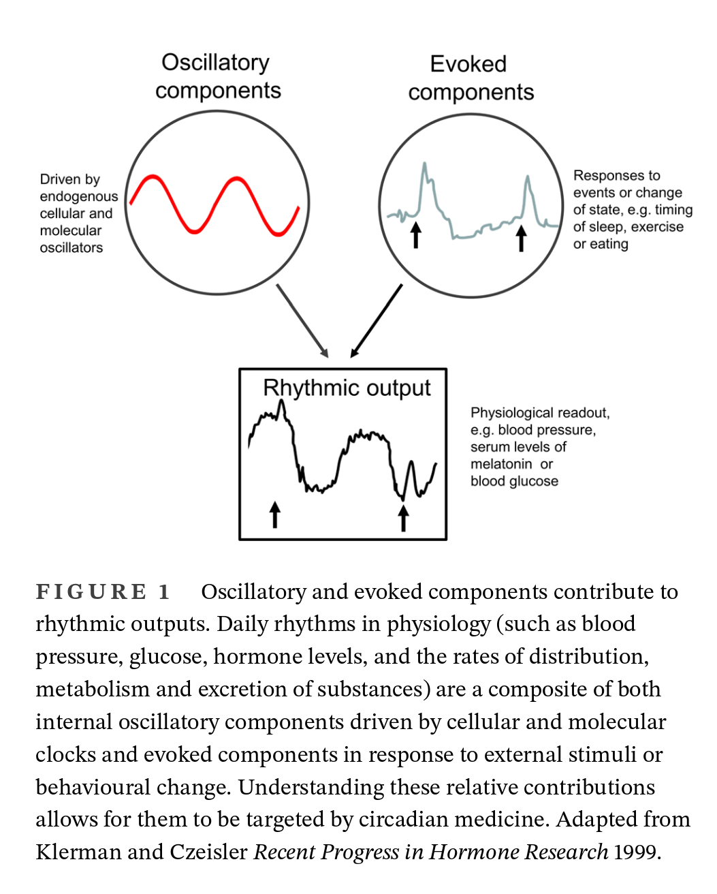
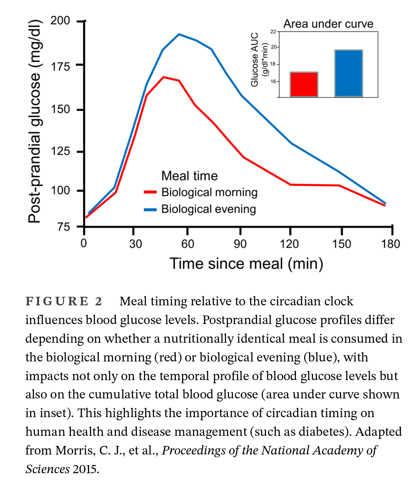
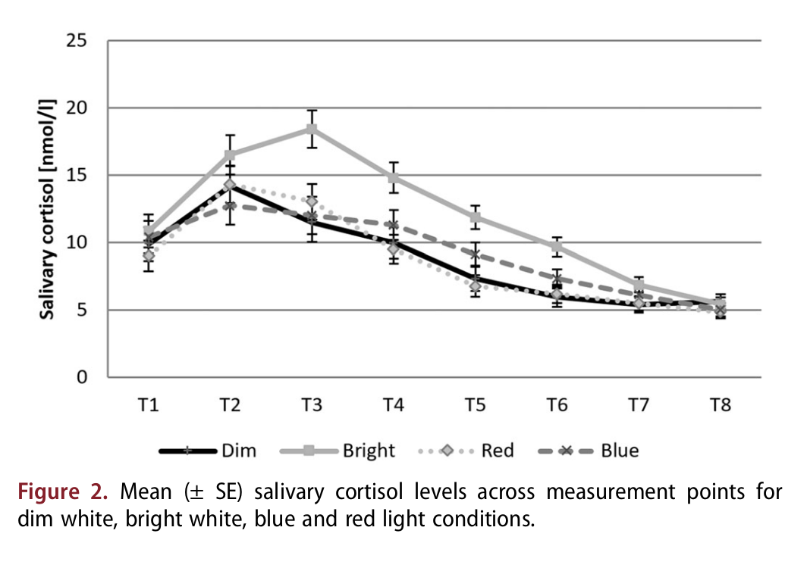
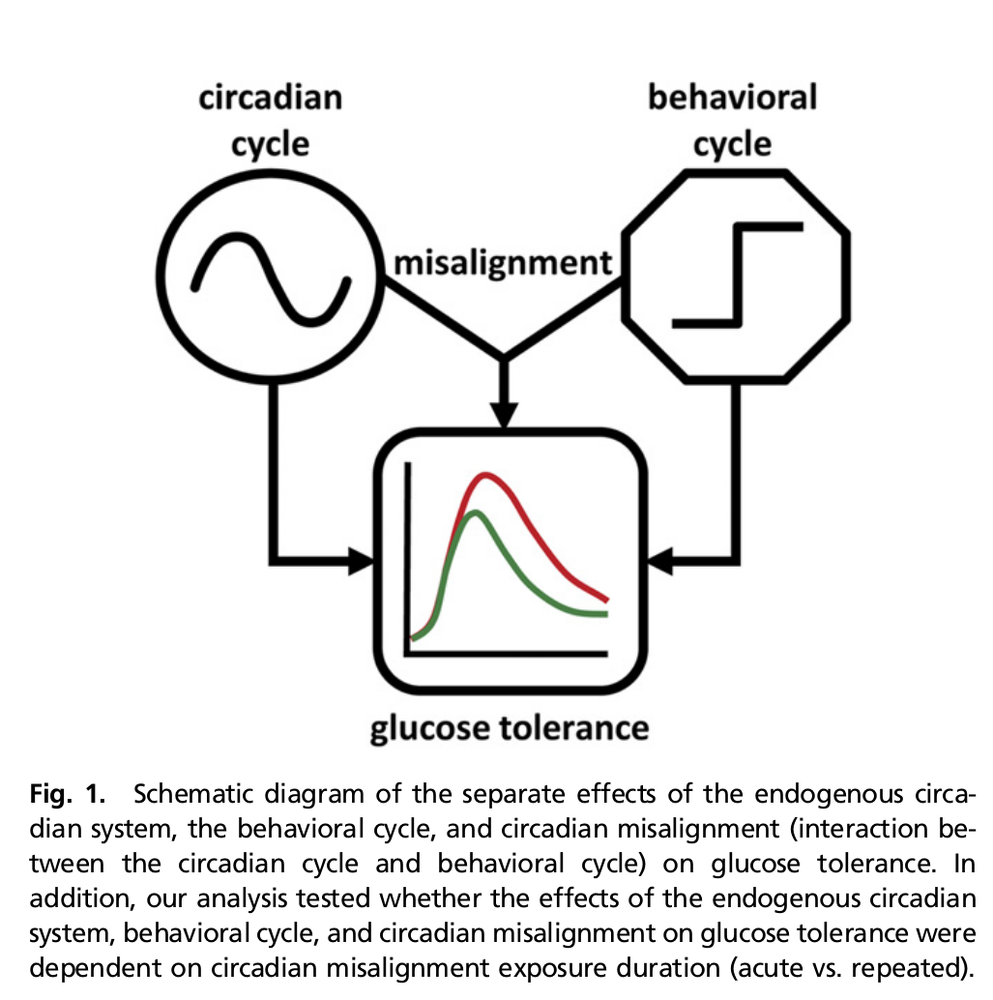

# PFun Glucose — Chronometabolic Analysis

> **Source document:** [`PFun Glucose - Chronometabolic Analysis.pdf`](rendered_pdf/PFun%20Glucose%20-%20Chronometabolic%20Analysis.pdf) (6 pages, by PFun Digital Health)

This page reproduces the content of the PFun Glucose Chronometabolic Analysis research summary, with extracted figures and formatted text. The document describes the physiological rationale and computational modeling approach underlying the PFun CMA model — a physiofunctional framework for circadian-ultradian glucose dynamics.

---

## Meal-induced (post-prandial) Blood Glucose responses

In this example, we observe three clearly-defined fluctuations in Blood Glucose that correspond to breakfast, lunch, and dinner (marked as $t_m$ on the x-axis).

## Circadian fluctuations in Blood Glucose

Blood Glucose is also affected by the time of day — relative to the circadian rhythm. Evidence in the literature shows that significant changes in blood glucose occur in healthy individuals throughout the circadian cycle.

There are several disorders — commonly comorbid with diabetes — that are broadly referred to as metabolic syndrome that primarily manifest as some form of disruption of healthy circadian metabolic dynamics.

---

## Glucose Dynamics

---

## Circadian Regulation of Glucose Tolerance

> (Klerman et al., 2022)

---

## Health relevance of Cortisol & Melatonin signals

Cortisol & Melatonin can be thought of as opposing forces. Melatonin is released by the pineal gland as part of the onset of sleep to peak around midnight. Melatonin deficiency can cause a decrease in sleep quality/duration.

Cortisol in contrast is an endogenous "wake-up call" that peaks around 7AM (sunrise). Without sufficient Cortisol, patients can feel lethargic even if they've had decent sleep.

> (Petrowski et al., 2021)

## Computational modeling of chronometabolic pathways

This example chronometabolic model of circadian-ultradian glucose dynamics is a representative implementation of the physiofunctional framework. By definition, the model therefore incorporates the health-relevant physiology. This is accomplished by careful quantification of a few key biophysical relationships — namely the interdependence of glucose and the endogenous hormones Cortisol, Melatonin, and Adiponectin.

---

## Endogenous Circadian System & Glucose Tolerance

> (Morris et al., 2015)

---

## References

1. **Klerman, E. B., Brager, A., Carskadon, M. A., Depner, C. M., Foster, R., Goel, N., Harrington, M., Holloway, P. M., Knauert, M. P., LeBourgeois, M. K., Lipton, J., Merrow, M., Montagnese, S., Ning, M., Ray, D., Scheer, F. A. J. L., Shea, S. A., Skene, D. J., Spies, C., … Burgess, H. J. (2022).** Keeping an eye on circadian time in clinical research and medicine. *Clinical and Translational Medicine*, *12*(12), e1131. [https://doi.org/10.1002/ctm2.1131](https://doi.org/10.1002/ctm2.1131)

2. **Morris, C. J., Yang, J. N., Garcia, J. I., Myers, S., Bozzi, I., Wang, W., Buxton, O. M., Shea, S. A., & Scheer, F. A. J. L. (2015).** Endogenous circadian system and circadian misalignment impact glucose tolerance via separate mechanisms in humans. *Proceedings of the National Academy of Sciences*, *112*(17), E2225–E2234. [https://doi.org/10.1073/pnas.1418955112](https://doi.org/10.1073/pnas.1418955112)

3. **Petrowski, K., Buehrer, S., Niedling, M., & Schmalbach, B. (2021).** The effects of light exposure on the cortisol stress response in human males. *Stress*, *24*(1), 29–35. [https://doi.org/10.1080/10253890.2020.1741543](https://doi.org/10.1080/10253890.2020.1741543)

---

→ [View the original PDF](rendered_pdf/PFun%20Glucose%20-%20Chronometabolic%20Analysis.pdf)  |  → [CMA Model Overview](model/overview.md)
